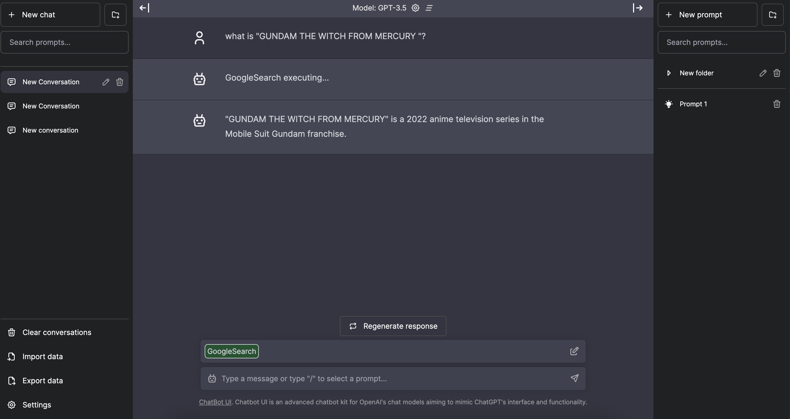

# Smart Chatbot UI

This is highly experimental personal project.

This project attempt to add more intelligent chatbot ux to [chatbot-ui](https://github.com/mckaywrigley/chatbot-ui).



## Updates

Chatbot UI will be updated over time.

Expect frequent improvements.

**Next up:**

- [ ] Delete messages
- [ ] More model settings

**Recent updates:**

- [x] Plugins(ChatGPT compatible) (4/17/23)
- [x] SSO Auth(email pattern matching only) (4/15/23)
- [x] Prompt templates (3/27/23)
- [x] Regenerate & edit responses (3/25/23)
- [x] Folders (3/24/23)
- [x] Search chat content (3/23/23)
- [x] Stop message generation (3/22/23)
- [x] Import/Export chats (3/22/23)
- [x] Custom system prompt (3/21/23)
- [x] Error handling (3/20/23)
- [x] GPT-4 support (access required) (3/20/23)
- [x] Search conversations (3/19/23)
- [x] Code syntax highlighting (3/18/23)
- [x] Toggle sidebar (3/18/23)
- [x] Conversation naming (3/18/23)
- [x] Github flavored markdown (3/18/23)
- [x] Add OpenAI API key in app (3/18/23)
- [x] Markdown support (3/17/23)

## Modifications

Modify the chat interface in `components/Chat`.

Modify the sidebar interface in `components/Sidebar`.

Modify the system prompt in `utils/server/index.ts`.

## Deploy

**Vercel**

Host your own live version of Chatbot UI with Vercel.

[](https://vercel.com/new/clone?repository-url=https%3A%2F%2Fgithub.com%2Fmckaywrigley%2Fchatbot-ui)

**Replit**

Fork Chatbot UI on Replit [here](https://replit.com/@MckayWrigley/chatbot-ui-pro?v=1).

**Docker**

Build locally:

```shell
docker build -t chatgpt-ui .
docker run -e OPENAI_API_KEY=xxxxxxxx -p 3000:3000 chatgpt-ui
```

Pull from ghcr:

```
docker run -e OPENAI_API_KEY=xxxxxxxx -p 3000:3000 ghcr.io/mckaywrigley/chatbot-ui:main
```

## Running Locally

**1. Clone Repo**

```bash
git clone https://github.com/mckaywrigley/chatbot-ui.git
```

**2. Install Dependencies**

```bash
npm i
```

**3. Provide OpenAI API Key**

Create a .env.local file in the root of the repo with your OpenAI API Key:

```bash
OPENAI_API_KEY=YOUR_KEY
```

> You can set `OPENAI_API_HOST` where access to the official OpenAI host is restricted or unavailable, allowing users to configure an alternative host for their specific needs.

> Additionally, if you have multiple OpenAI Organizations, you can set `OPENAI_ORGANIZATION` to specify one.

**4. Run App**

```bash
npm run dev
```

**5. Use It**

You should be able to start chatting.

## Configuration

When deploying the application, the following environment variables can be set:

| Environment Variable  | Default value                  | Description                                             |
| --------------------- | ------------------------------ | ------------------------------------------------------- |
| OPENAI_API_KEY        |                                | The default API key used for authentication with OpenAI |
| OPENAI_API_HOST       | `https://api.openai.com`       | The base url, for Azure use `https://<endpoint>.openai.azure.com` |
| OPENAI_API_TYPE       | `openai`                       | The API type, options are `openai` or `azure`           |
| OPENAI_API_VERSION    | `2023-03-15-preview`           | Only applicable for Azure OpenAI                        |
| AZURE_DEPLOYMENT_ID   |                                | Needed when Azure OpenAI, Ref [Azure OpenAI API](https://learn.microsoft.com/zh-cn/azure/cognitive-services/openai/reference#completions)                                |
| OPENAI_ORGANIZATION   |                                | Your OpenAI organization ID                             |
| DEFAULT_MODEL         | `gpt-3.5-turbo`                | The default model to use on new conversations, for Azure use `gpt-35-turbo` |
| NEXT_PUBLIC_DEFAULT_SYSTEM_PROMPT | [see here](utils/app/const.ts) | The default system prompt to use on new conversations   |
| GOOGLE_API_KEY        |                                | See [Custom Search JSON API documentation][GCSE]        |
| GOOGLE_CSE_ID         |                                | See [Custom Search JSON API documentation][GCSE]        |
| NEXTAUTH_ENABLED      | `false`                        | Enable SSO authentication. set 'true' or 'false'                                                                                          |
| NEXTAUTH_EMAIL_PATTERN |                               | The email regex pattern granted access to chatbot-ui                                                                                      |
| NEXTAUTH_URL          | `http://localhost:3000`        | NextAuth Settings. See [Official Document](https://next-auth.js.org/configuration/options)                                                |
| NEXTAUTH_SECRET       |                                | NextAuth Settings. See [Official Document](https://next-auth.js.org/configuration/options)                                                |
| GITHUB_CLIENT_ID      |                                | GitHub OAuth Client ID for NextAuth                                                                                                       |
| GITHUB_CLIENT_SECRET  |                                | GitHub OAuth Client Secret for NextAuth                                                                                                   |
| GOOGLE_CLIENT_ID      |                                | Google OAuth Client ID for NextAuth                                                                                                       |
| GOOGLE_CLIENT_SECRET  |                                | Google OAuth Client Secret for NextAuth                                                                                                   |


If you do not provide an OpenAI API key with `OPENAI_API_KEY`, users will have to provide their own key.
If you don't have an OpenAI API key, you can get one [here](https://platform.openai.com/account/api-keys).

## Plugin Settings

### ChatGPT compatible plugin

You can add a ChatGPT compatible plugin to `urls` field in `plugins.json`.

### Internal Tools

You can control the tools you want to use with `internals` in `plugins.json`.

## Contact

If you have any questions, feel free to reach out to me on [Twitter](https://twitter.com/santa128bit).

[GCSE]: https://developers.google.com/custom-search/v1/overview
